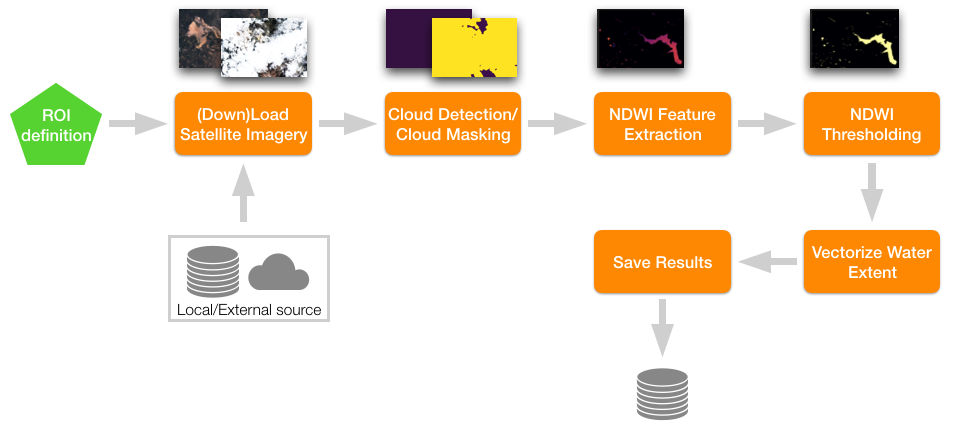

[](https://pypi.org/project/eo-learn/)
[](https://travis-ci.org/sentinel-hub/eo-learn)
[](https://eo-learn.readthedocs.io)
[](https://github.com/sentinel-hub/eo-learn/blob/master/LICENSE)
[](https://pepy.tech/project/eo-learn)
[](https://pepy.tech/project/eo-learn)


# eo-learn
**eo-learn makes extraction of valuable information from satellite imagery easy.**

The availability of open Earth observation (EO) data through the Copernicus and Landsat programs represents an
unprecedented resource for many EO applications, ranging from ocean and land use and land cover monitoring,
disaster control, emergency services and humanitarian relief. Given the large amount of high spatial resolution
data at high revisit frequency, techniques able to automatically extract complex patterns in such _spatio-temporal_
data are needed.

**`eo-learn`** is a collection of open source Python packages that have been developed to seamlessly access and process
_spatio-temporal_ image sequences acquired by any satellite fleet in a timely and automatic manner. **`eo-learn`** is
easy to use, it's design modular, and encourages collaboration -- sharing and reusing of specific tasks in a typical
EO-value-extraction workflows, such as cloud masking, image co-registration, feature extraction, classification, etc. Everyone is free
to use any of the available tasks and is encouraged to improve the, develop new ones and share them with the rest of the community.

**`eo-learn`** makes extraction of valuable information from satellite imagery as easy as defining a sequence of operations to be performed on satellite imagery. Image below illustrates a processing chain that maps water in satellite imagery by thresholding the Normalised Difference Water Index in user specified region of interest.



**`eo-learn`** _library acts as a bridge between Earth observation/Remote sensing field and Python ecosystem for data science and machine learning._ The library is written in Python and uses NumPy arrays to store and handle remote sensing data. Its aim is to make entry easier for non-experts to the field of remote sensing on one hand and bring the state-of-the-art tools for computer vision, machine learning, and deep learning existing in Python ecosystem to remote sensing experts.

## Package Overview

**`eo-learn`** is divided into several subpackages according to different functionalities and external package dependencies. Therefore it is not necessary for user to install entire package but only the parts that he needs.

At the moment there are the following subpackages:

- **`eo-learn-core`** - The main subpackage which implements basic building blocks (`EOPatch`, `EOTask` and `EOWorkflow`) and commonly used functionalities.
- **`eo-learn-coregistration`** - The subpackage that deals with image co-registraion.
- **`eo-learn-features`** - A collection of utilities for extracting data properties and feature manipulation.
- **`eo-learn-geometry`** - Geometry subpackage used for geometric transformation and conversion between vector and raster data.
- **`eo-learn-io`** - Input/output subpackage that deals with obtaining data from Sentinel Hub services or saving and loading data locally.
- **`eo-learn-mask`** - The subpackage used for masking of data and calculation of cloud masks.
- **`eo-learn-ml-tools`** - Various tools that can be used before or after the machine learning process.
- **`eo-learn-visualization`** - Visualization tools for core elements of eo-learn.

## Installation

The package requires Python version **>=3.5** . It can be installed with:

```bash
pip install eo-learn
```

In order to avoid heavy package dependencies it is possible to install each subpackage separately:
```bash
pip install eo-learn-core
pip install eo-learn-coregistration
pip install eo-learn-features
pip install eo-learn-geometry
pip install eo-learn-io
pip install eo-learn-mask
pip install eo-learn-ml-tools
pip install eo-learn-visualization
```

Before installing `eo-learn` on **Windows** it is recommended to install the following packages from [Unofficial Windows wheels repository](https://www.lfd.uci.edu/~gohlke/pythonlibs/):

```bash
gdal
rasterio
shapely
fiona
```

One of dependecies of `eo-learn-mask` subpackage is `lightgbm` package. On windows it requires 64 bit Python distribution. If having problems during installation please check [LightGBM installation guide](https://lightgbm.readthedocs.io/en/latest/Installation-Guide.html).

A part of subpackage `eo-learn-visualization` requires additional dependencies which don't get installed by default. Those can be installed with

```bash
pip install eo-learn-visualization[FULL]
```

## Documentation

For more information on the package content, visit [readthedocs](https://eo-learn.readthedocs.io/).

## Contributions

If you would like to contribute to `eo-learn`, check out our [contribution guidelines](./CONTRIBUTING.md).

## Blog posts and papers

 * [Introducing eo-learn](https://medium.com/sentinel-hub/introducing-eo-learn-ab37f2869f5c) (by Devis Peressutti)
 * [Land Cover Classification with eo-learn: Part 1 - Mastering Satellite Image Data in an Open-Source Python Environment](https://medium.com/sentinel-hub/land-cover-classification-with-eo-learn-part-1-2471e8098195) (by Matic Lubej)
 * [Land Cover Classification with eo-learn: Part 2 - Going from Data to Predictions in the Comfort of Your Laptop](https://medium.com/sentinel-hub/land-cover-classification-with-eo-learn-part-2-bd9aa86f8500) (by Matic Lubej)
 * [Land Cover Classification with eo-learn: Part 3 - Pushing Beyond the Point of “Good Enough”](https://medium.com/sentinel-hub/land-cover-classification-with-eo-learn-part-3-c62ed9ecd405) (by Matic Lubej)
 * [Innovations in satellite measurements for development](https://blogs.worldbank.org/opendata/innovations-satellite-measurements-development)
 * [Use eo-learn with AWS SageMaker](https://medium.com/@drewbo19/use-eo-learn-with-aws-sagemaker-9420856aafb5) (by Drew Bollinger)
 * [Spatio-Temporal Deep Learning: An Application to Land Cover Classification](https://www.researchgate.net/publication/333262625_Spatio-Temporal_Deep_Learning_An_Application_to_Land_Cover_Classification)(by Anze Zupanc) 

## Questions and Issues

Feel free to ask questions about the package and its use cases at [Sentinel Hub forum](https://forum.sentinel-hub.com/) or raise an issue on [GitHub](https://github.com/sentinel-hub/eo-learn/issues).

You are welcome to send your feedback to the package authors, EO Research team, through any of [Sentinel Hub communication channel](https://sentinel-hub.com/develop/communication-channels).


## License

See [LICENSE](https://github.com/sentinel-hub/eo-learn/blob/master/LICENSE).

## Acknowledgements 

This project has received funding from the European Union’s Horizon 2020 research and innovation programme under grant agreement No. 776115.
